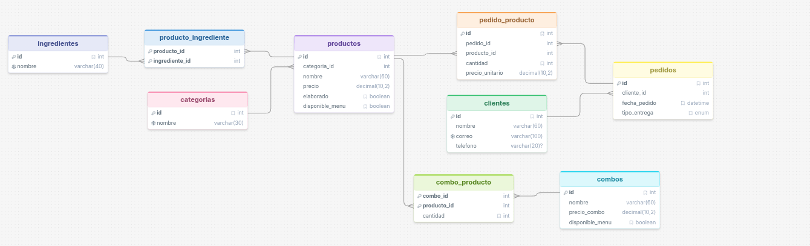
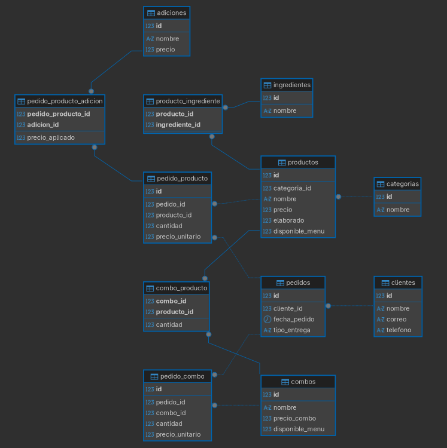

# Sistema de gestión para una pizzería

Modelado entidad-relación (PK, FK, `UNIQUE`, `CHECK`, `DEFAULT`, relaciones N:M) más consultas con `JOIN`, `GROUP BY` y subconsultas.

## Contexto

El enunciado original (ver más abajo) pide diseñar la base de datos de una pizzería que gestiona productos (pizzas, panzarottis, bebidas, postres), sus ingredientes, las adiciones con las que un cliente personaliza un producto, los combos que agrupan varios productos a un precio especial, y los pedidos de los clientes (para recoger o para consumir en el local).




## 1. Entidades, atributos y clave primaria

| Entidad | Atributos relevantes | Clave primaria |
|---|---|---|
| **Cliente** | nombre, correo, teléfono | `id` |
| **Categoría** | nombre | `id` |
| **Producto** | nombre, precio, elaborado, disponible_menu | `id` |
| **Ingrediente** | nombre | `id` |
| **Adición** | nombre, precio | `id` |
| **Combo** | nombre, precio_combo, disponible_menu | `id` |
| **Pedido** | fecha_pedido, tipo_entrega | `id` |

`Producto.elaborado` distingue los productos que se preparan con ingredientes (pizzas, panzarottis) de los que se venden tal cual (bebidas, postres), que es justo lo que pide el enunciado al decir "se debe tener en cuenta los ingredientes que poseen los productos".

## 2. Relaciones y cardinalidad

| Relación | Cardinalidad | Resuelta con |
|---|---|---|
| Cliente — Pedido | 1:N | FK `pedidos.cliente_id` |
| Pedido — Producto | N:M | tabla intermedia `pedido_producto` (con `cantidad` y `precio_unitario`) |
| Pedido — Combo | N:M | tabla intermedia `pedido_combo` |
| Producto — Ingrediente | N:M | tabla intermedia `producto_ingrediente` |
| Combo — Producto | N:M | tabla intermedia `combo_producto` (con `cantidad`) |
| Línea de pedido (`pedido_producto`) — Adición | N:M | tabla intermedia `pedido_producto_adicion` |
| Producto — Categoría | 1:N | FK `productos.categoria_id` |

Las relaciones N:M entre **pedido** y **producto** no se resuelven con una FK directa porque un mismo pedido incluye varios productos y un mismo producto se vende en muchos pedidos; por eso existe `pedido_producto` como tabla intermedia, que además guarda `cantidad` y `precio_unitario` (el precio se "congela" al momento de la venta, para que un cambio futuro en `productos.precio` no altere pedidos ya facturados). La personalización con adiciones se modela un nivel más abajo, sobre la **línea de pedido** (`pedido_producto`) y no sobre el producto en general, porque la misma pizza puede pedirse con o sin extra queso según el pedido.

## 3. Normalización de las tablas

Revisando las 12 tablas contra las tres formas normales básicas:

- **1FN:** se cumple en todas las tablas. No hay columnas que guarden listas de valores (los ingredientes de un producto no se guardan como texto separado por comas, sino en la tabla intermedia `producto_ingrediente`, una fila por ingrediente).
- **2FN:** solo aplica a las tablas con clave compuesta (`producto_ingrediente`, `combo_producto`, `pedido_producto_adicion`). En `combo_producto`, `cantidad` depende de la combinación `(combo_id, producto_id)` completa, no de uno de los dos; lo mismo pasa con `precio_aplicado` en `pedido_producto_adicion`. El resto de tablas usa clave simple (`id` autoincremental), así que la 2FN se cumple automáticamente.
- **3FN:** se cumple en todas las tablas. En `productos`, ni `precio` ni `disponible_menu` dependen de `nombre` ni entre sí; cada uno depende únicamente de `id`.

`pedido_producto.precio_unitario` y `pedido_combo.precio_unitario` repiten un valor que también existe en `productos.precio` / `combos.precio_combo`, pero se guardan aparte a propósito para "congelar" el precio en el momento de la venta.

## 4. Cómo funciona el script

1. `pizzeria_estructura.sql` crea la base `pizzeria` y 12 tablas: `categorias`, `productos`, `ingredientes`, `producto_ingrediente`, `adiciones`, `combos`, `combo_producto`, `clientes`, `pedidos`, `pedido_producto`, `pedido_producto_adicion`, `pedido_combo`.
2. `pizzeria_datos.sql` inserta: 4 categorías, 11 productos (4 pizzas, 2 panzarottis, 3 bebidas, 2 postres), 9 ingredientes, 4 adiciones, 3 combos, 6 clientes y 22 pedidos con sus líneas de producto, adiciones aplicadas y combos vendidos.
3. Los datos cubren a propósito varios escenarios: pedidos dentro y fuera del "último mes" (respecto al 2026-06-25), un cliente con más de 5 pedidos en el último mes, clientes que usan ambos tipos de entrega, un pedido con más de 3 productos distintos, panzarottis con extra queso, combos que incluyen bebidas, etc.

## 5. `CREATE TABLE` del modelo

```sql
CREATE TABLE categorias (
    id INT PRIMARY KEY AUTO_INCREMENT,
    nombre VARCHAR(30) NOT NULL UNIQUE
);

CREATE TABLE productos (
    id INT PRIMARY KEY AUTO_INCREMENT,
    categoria_id INT NOT NULL,
    nombre VARCHAR(60) NOT NULL,
    precio DECIMAL(10,2) NOT NULL CHECK (precio >= 0),
    elaborado BOOLEAN NOT NULL DEFAULT TRUE,
    disponible_menu BOOLEAN NOT NULL DEFAULT TRUE,
    FOREIGN KEY (categoria_id) REFERENCES categorias(id)
);

CREATE TABLE ingredientes (
    id INT PRIMARY KEY AUTO_INCREMENT,
    nombre VARCHAR(40) NOT NULL UNIQUE
);

CREATE TABLE producto_ingrediente (
    producto_id INT NOT NULL,
    ingrediente_id INT NOT NULL,
    PRIMARY KEY (producto_id, ingrediente_id),
    FOREIGN KEY (producto_id) REFERENCES productos(id),
    FOREIGN KEY (ingrediente_id) REFERENCES ingredientes(id)
);

CREATE TABLE adiciones (
    id INT PRIMARY KEY AUTO_INCREMENT,
    nombre VARCHAR(40) NOT NULL UNIQUE,
    precio DECIMAL(10,2) NOT NULL DEFAULT 0 CHECK (precio >= 0)
);

CREATE TABLE combos (
    id INT PRIMARY KEY AUTO_INCREMENT,
    nombre VARCHAR(60) NOT NULL,
    precio_combo DECIMAL(10,2) NOT NULL CHECK (precio_combo >= 0),
    disponible_menu BOOLEAN NOT NULL DEFAULT TRUE
);

CREATE TABLE combo_producto (
    combo_id INT NOT NULL,
    producto_id INT NOT NULL,
    cantidad INT NOT NULL DEFAULT 1 CHECK (cantidad > 0),
    PRIMARY KEY (combo_id, producto_id),
    FOREIGN KEY (combo_id) REFERENCES combos(id),
    FOREIGN KEY (producto_id) REFERENCES productos(id)
);

CREATE TABLE clientes (
    id INT PRIMARY KEY AUTO_INCREMENT,
    nombre VARCHAR(60) NOT NULL,
    correo VARCHAR(100) NOT NULL UNIQUE,
    telefono VARCHAR(20)
);

CREATE TABLE pedidos (
    id INT PRIMARY KEY AUTO_INCREMENT,
    cliente_id INT NOT NULL,
    fecha_pedido DATETIME NOT NULL DEFAULT CURRENT_TIMESTAMP,
    tipo_entrega ENUM('Recoger', 'Local') NOT NULL DEFAULT 'Local',
    FOREIGN KEY (cliente_id) REFERENCES clientes(id)
);

CREATE TABLE pedido_producto (
    id INT PRIMARY KEY AUTO_INCREMENT,
    pedido_id INT NOT NULL,
    producto_id INT NOT NULL,
    cantidad INT NOT NULL DEFAULT 1 CHECK (cantidad > 0),
    precio_unitario DECIMAL(10,2) NOT NULL,
    FOREIGN KEY (pedido_id) REFERENCES pedidos(id),
    FOREIGN KEY (producto_id) REFERENCES productos(id)
);

CREATE TABLE pedido_producto_adicion (
    pedido_producto_id INT NOT NULL,
    adicion_id INT NOT NULL,
    precio_aplicado DECIMAL(10,2) NOT NULL,
    PRIMARY KEY (pedido_producto_id, adicion_id),
    FOREIGN KEY (pedido_producto_id) REFERENCES pedido_producto(id),
    FOREIGN KEY (adicion_id) REFERENCES adiciones(id)
);

CREATE TABLE pedido_combo (
    id INT PRIMARY KEY AUTO_INCREMENT,
    pedido_id INT NOT NULL,
    combo_id INT NOT NULL,
    cantidad INT NOT NULL DEFAULT 1 CHECK (cantidad > 0),
    precio_unitario DECIMAL(10,2) NOT NULL,
    FOREIGN KEY (pedido_id) REFERENCES pedidos(id),
    FOREIGN KEY (combo_id) REFERENCES combos(id)
);
```

## 6. Consultas solicitadas

Todas parten de la misma base de datos (`pizzeria_estructura.sql` + `pizzeria_datos.sql`). Las fechas de ejemplo toman el **2026-06-25** como "hoy", así que "el último mes" equivale a `fecha_pedido >= '2026-05-25'`.

### 1. Productos más vendidos

```sql
SELECT p.nombre AS producto, SUM(pp.cantidad) AS unidades_vendidas
FROM pedido_producto pp
JOIN productos p ON p.id = pp.producto_id
GROUP BY p.id, p.nombre
ORDER BY unidades_vendidas DESC;
```

**Resultado esperado (top 4):** Pizza Margarita (5), Pizza Hawaiana (4), Panzarotti Pollo (3), Brownie (3).

### 2. Total de ingresos generados por cada combo

```sql
SELECT c.nombre AS combo, SUM(pc.cantidad * pc.precio_unitario) AS ingresos
FROM pedido_combo pc
JOIN combos c ON c.id = pc.combo_id
GROUP BY c.id, c.nombre
ORDER BY ingresos DESC;
```

**Resultado esperado:** Combo Pareja $76.000, Combo Fiesta $62.000, Combo Personal $32.000.

### 3. Pedidos para recoger vs. para comer en la pizzería

```sql
SELECT tipo_entrega, COUNT(*) AS total_pedidos
FROM pedidos
GROUP BY tipo_entrega;
```

**Resultado esperado:** Recoger 12, Local 10.

### 4. Adiciones más solicitadas en pedidos personalizados

```sql
SELECT a.nombre AS adicion, COUNT(*) AS veces_solicitada
FROM pedido_producto_adicion ppa
JOIN adiciones a ON a.id = ppa.adicion_id
GROUP BY a.id, a.nombre
ORDER BY veces_solicitada DESC;
```

**Resultado esperado:** Extra queso (5), Extra pepperoni (1), Salsa BBQ (1), Salsa de ajo (0).

### 5. Cantidad total de productos vendidos por categoría

```sql
SELECT cat.nombre AS categoria, SUM(pp.cantidad) AS unidades_vendidas
FROM pedido_producto pp
JOIN productos p ON p.id = pp.producto_id
JOIN categorias cat ON cat.id = p.categoria_id
GROUP BY cat.id, cat.nombre
ORDER BY unidades_vendidas DESC;
```

**Resultado esperado:** Pizza (13), Panzarotti (5), Bebida (4), Postre (4).

### 6. Promedio de pizzas pedidas por cliente

```sql
SELECT
    (SELECT SUM(pp.cantidad)
     FROM pedido_producto pp
     JOIN productos p ON p.id = pp.producto_id
     JOIN categorias cat ON cat.id = p.categoria_id
     WHERE cat.nombre = 'Pizza')
    /
    (SELECT COUNT(*) FROM clientes) AS promedio_pizzas_por_cliente;
```

**Resultado esperado:** 13 unidades de pizza / 6 clientes ≈ **2.17**.

### 7. Total de ventas por día de la semana

```sql
SELECT DAYNAME(t.fecha_pedido) AS dia_semana, SUM(t.monto) AS ventas_totales
FROM (
    SELECT pe.id AS pedido_id, pe.fecha_pedido, pp.cantidad * pp.precio_unitario AS monto
    FROM pedidos pe
    JOIN pedido_producto pp ON pp.pedido_id = pe.id

    UNION ALL

    SELECT pe.id AS pedido_id, pe.fecha_pedido, ppa.precio_aplicado AS monto
    FROM pedidos pe
    JOIN pedido_producto pp ON pp.pedido_id = pe.id
    JOIN pedido_producto_adicion ppa ON ppa.pedido_producto_id = pp.id

    UNION ALL

    SELECT pe.id AS pedido_id, pe.fecha_pedido, pc.cantidad * pc.precio_unitario AS monto
    FROM pedidos pe
    JOIN pedido_combo pc ON pc.pedido_id = pe.id
) AS t
GROUP BY dia_semana
ORDER BY ventas_totales DESC;
```

**Resultado esperado:** Viernes $274.000, Sábado $197.000, Miércoles $123.000, Lunes $118.500.

### 8. Cantidad de panzarottis vendidos con extra queso

```sql
SELECT SUM(pp.cantidad) AS panzarottis_con_extra_queso
FROM pedido_producto pp
JOIN productos p ON p.id = pp.producto_id
JOIN categorias cat ON cat.id = p.categoria_id
JOIN pedido_producto_adicion ppa ON ppa.pedido_producto_id = pp.id
JOIN adiciones a ON a.id = ppa.adicion_id
WHERE cat.nombre = 'Panzarotti' AND a.nombre = 'Extra queso';
```

**Resultado esperado:** 3.

### 9. Pedidos que incluyen bebidas como parte de un combo

```sql
SELECT DISTINCT pe.id AS pedido_id, cl.nombre AS cliente, c.nombre AS combo
FROM pedidos pe
JOIN clientes cl ON cl.id = pe.cliente_id
JOIN pedido_combo pcomb ON pcomb.pedido_id = pe.id
JOIN combos c ON c.id = pcomb.combo_id
JOIN combo_producto cp ON cp.combo_id = c.id
JOIN productos p ON p.id = cp.producto_id
JOIN categorias cat ON cat.id = p.categoria_id
WHERE cat.nombre = 'Bebida';
```

**Resultado esperado:** 4 pedidos (los 3 combos del catálogo incluyen al menos una gaseosa).

### 10. Clientes que han realizado más de 5 pedidos en el último mes

```sql
SELECT *
FROM (
    SELECT cl.id, cl.nombre, COUNT(*) AS pedidos_ultimo_mes
    FROM clientes cl
    JOIN pedidos pe ON pe.cliente_id = cl.id
    WHERE pe.fecha_pedido >= '2026-05-25'
    GROUP BY cl.id, cl.nombre
) AS resumen
WHERE pedidos_ultimo_mes > 5;
```

**Resultado esperado:** Carla Méndez (6 pedidos).

### 11. Ingresos totales generados por productos no elaborados

```sql
SELECT SUM(pp.cantidad * pp.precio_unitario) AS ingresos_no_elaborados
FROM pedido_producto pp
JOIN productos p ON p.id = pp.producto_id
WHERE p.elaborado = FALSE;
```

**Resultado esperado:** $48.000.

### 12. Promedio de adiciones por pedido

```sql
SELECT ROUND(
    (SELECT COUNT(*) FROM pedido_producto_adicion) / (SELECT COUNT(*) FROM pedidos),
    2
) AS promedio_adiciones_por_pedido;
```

**Resultado esperado:** 7 / 22 ≈ **0.32**.

### 13. Total de combos vendidos en el último mes

```sql
SELECT SUM(pc.cantidad) AS combos_vendidos_ultimo_mes
FROM pedido_combo pc
JOIN pedidos pe ON pe.id = pc.pedido_id
WHERE pe.fecha_pedido >= '2026-05-25';
```

**Resultado esperado:** 3 (el combo de Santiago del 2026-05-15 queda fuera del rango).

### 14. Clientes con pedidos tanto para recoger como para consumir en el lugar

```sql
SELECT *
FROM (
    SELECT cl.id, cl.nombre, COUNT(DISTINCT pe.tipo_entrega) AS tipos_entrega_usados
    FROM clientes cl
    JOIN pedidos pe ON pe.cliente_id = cl.id
    GROUP BY cl.id, cl.nombre
) AS resumen
WHERE tipos_entrega_usados = 2;
```

**Resultado esperado:** los 6 clientes del set de datos alternan entre ambos tipos de entrega.

### 15. Total de productos personalizados con adiciones

```sql
SELECT COUNT(DISTINCT pedido_producto_id) AS productos_personalizados
FROM pedido_producto_adicion;
```

**Resultado esperado:** 7.

### 16. Pedidos con más de 3 productos diferentes

```sql
SELECT *
FROM (
    SELECT pe.id AS pedido_id, cl.nombre AS cliente, COUNT(DISTINCT pp.producto_id) AS productos_diferentes
    FROM pedidos pe
    JOIN clientes cl ON cl.id = pe.cliente_id
    JOIN pedido_producto pp ON pp.pedido_id = pe.id
    GROUP BY pe.id, cl.nombre
) AS resumen
WHERE productos_diferentes > 3;
```

**Resultado esperado:** el pedido de Valentina Cruz del 2026-06-20, con 4 productos diferentes (Pizza Margarita, Pizza Hawaiana, Panzarotti Pollo y Brownie).

### 17. Promedio de ingresos generados por día

```sql
SELECT AVG(ventas_dia) AS promedio_ingresos_por_dia
FROM (
    SELECT DATE(t.fecha_pedido) AS dia, SUM(t.monto) AS ventas_dia
    FROM (
        SELECT pe.id AS pedido_id, pe.fecha_pedido, pp.cantidad * pp.precio_unitario AS monto
        FROM pedidos pe
        JOIN pedido_producto pp ON pp.pedido_id = pe.id

        UNION ALL

        SELECT pe.id AS pedido_id, pe.fecha_pedido, ppa.precio_aplicado AS monto
        FROM pedidos pe
        JOIN pedido_producto pp ON pp.pedido_id = pe.id
        JOIN pedido_producto_adicion ppa ON ppa.pedido_producto_id = pp.id

        UNION ALL

        SELECT pe.id AS pedido_id, pe.fecha_pedido, pc.cantidad * pc.precio_unitario AS monto
        FROM pedidos pe
        JOIN pedido_combo pc ON pc.pedido_id = pe.id
    ) AS t
    GROUP BY DATE(t.fecha_pedido)
) AS ventas_por_dia;
```

**Resultado esperado:** $712.500 repartidos en 18 días distintos con ventas ≈ **$39.583**.

### 18. Clientes que han pedido pizzas con adiciones en más del 50% de sus pedidos

```sql
SELECT *
FROM (
    SELECT cl.id, cl.nombre,
           COUNT(*) AS total_lineas_pizza,
           COUNT(ppa.pedido_producto_id) AS pizzas_con_adicion,
           ROUND(100 * COUNT(ppa.pedido_producto_id) / COUNT(*), 1) AS porcentaje
    FROM pedidos pe
    JOIN clientes cl ON cl.id = pe.cliente_id
    JOIN pedido_producto pp ON pp.pedido_id = pe.id
    JOIN productos p ON p.id = pp.producto_id
    JOIN categorias cat ON cat.id = p.categoria_id
    LEFT JOIN (SELECT DISTINCT pedido_producto_id FROM pedido_producto_adicion) ppa
           ON ppa.pedido_producto_id = pp.id
    WHERE cat.nombre = 'Pizza'
    GROUP BY cl.id, cl.nombre
) AS resumen
WHERE porcentaje > 50;
```

**Resultado esperado:** Lucía Fernández — 3 de 4 pizzas con adición (**75%**).

### 19. Porcentaje de ventas provenientes de productos no elaborados

```sql
SELECT t.ingresos_no_elaborados,
       t.ingresos_totales,
       ROUND(100 * t.ingresos_no_elaborados / t.ingresos_totales, 2) AS porcentaje_no_elaborados
FROM (
    SELECT
        (SELECT SUM(pp.cantidad * pp.precio_unitario)
         FROM pedido_producto pp JOIN productos p ON p.id = pp.producto_id
         WHERE p.elaborado = FALSE) AS ingresos_no_elaborados,
        (SELECT SUM(monto) FROM (
            SELECT pp.cantidad * pp.precio_unitario AS monto
            FROM pedido_producto pp

            UNION ALL

            SELECT ppa.precio_aplicado AS monto
            FROM pedido_producto_adicion ppa

            UNION ALL

            SELECT pc.cantidad * pc.precio_unitario AS monto
            FROM pedido_combo pc
        ) AS ventas) AS ingresos_totales
) AS t;
```

**Resultado esperado:** $48.000 / $712.500 ≈ **6.74%**.

### 20. Día de la semana con mayor número de pedidos para recoger

```sql
SELECT DAYNAME(fecha_pedido) AS dia_semana, COUNT(*) AS pedidos_para_recoger
FROM pedidos
WHERE tipo_entrega = 'Recoger'
GROUP BY dia_semana
ORDER BY pedidos_para_recoger DESC
LIMIT 1;
```

**Resultado esperado:** Viernes, con 6 pedidos para recoger.

## 7. Restricciones aplicadas

- `PRIMARY KEY` + `AUTO_INCREMENT` en todas las tablas con `id` propio.
- `FOREIGN KEY` en `productos`, `producto_ingrediente` (x2), `combo_producto` (x2), `pedidos`, `pedido_producto` (x2), `pedido_producto_adicion` (x2) y `pedido_combo` (x2).
- `UNIQUE` en `categorias.nombre`, `ingredientes.nombre`, `adiciones.nombre` y `clientes.correo`.
- `CHECK` en precios (`productos.precio`, `adiciones.precio`, `combos.precio_combo`) y en cantidades (`combo_producto.cantidad`, `pedido_producto.cantidad`, `pedido_combo.cantidad`) para que nunca sean negativos o cero.
- `DEFAULT` en `productos.disponible_menu`, `combos.disponible_menu`, `pedidos.fecha_pedido` (`CURRENT_TIMESTAMP`) y `pedidos.tipo_entrega` (`'Local'`).
- `NOT NULL` en los atributos indispensables de cada entidad.
- Relaciones N:M resueltas con tablas intermedias: `producto_ingrediente`, `combo_producto`, `pedido_producto`, `pedido_combo` y `pedido_producto_adicion`.

## Enunciado original

El propósito de este examen es diseñar una base de datos que permita gestionar eficientemente los productos, combos, pedidos y clientes de una pizzería. El sistema debe almacenar información sobre pizzas, panzarottis, otros productos no elaborados (bebidas, postres, etc.), adiciones y el menú disponible. Además, se deberán registrar los pedidos de los clientes, que pueden ser para consumir en el lugar o para recoger.

**Problema:** la pizzería actualmente no tiene un sistema centralizado para gestionar sus productos y pedidos, lo que genera confusión al manejar inventarios, combos y opciones de pedidos. También resulta difícil hacer un seguimiento de los productos más vendidos o personalizar pedidos.

**Características principales:** gestión de productos (con sus ingredientes), gestión de adiciones, gestión de combos, gestión de pedidos (recoger o consumir en el lugar, con personalización mediante adiciones) y gestión del menú.

**Consultas a realizar:**

1. Productos más vendidos (pizza, panzarottis, bebidas, etc.)
2. Total de ingresos generados por cada combo
3. Pedidos realizados para recoger vs. comer en la pizzería
4. Adiciones más solicitadas en pedidos personalizados
5. Cantidad total de productos vendidos por categoría
6. Promedio de pizzas pedidas por cliente
7. Total de ventas por día de la semana
8. Cantidad de panzarottis vendidos con extra queso
9. Pedidos que incluyen bebidas como parte de un combo
10. Clientes que han realizado más de 5 pedidos en el último mes
11. Ingresos totales generados por productos no elaborados (bebidas, postres, etc.)
12. Promedio de adiciones por pedido
13. Total de combos vendidos en el último mes
14. Clientes con pedidos tanto para recoger como para consumir en el lugar
15. Total de productos personalizados con adiciones
16. Pedidos con más de 3 productos diferentes
17. Promedio de ingresos generados por día
18. Clientes que han pedido pizzas con adiciones en más del 50% de sus pedidos
19. Porcentaje de ventas provenientes de productos no elaborados
20. Día de la semana con mayor número de pedidos para recoger
